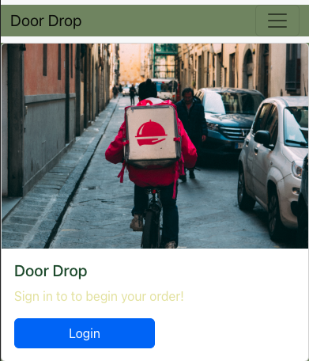
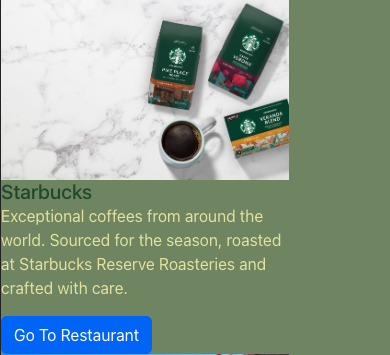
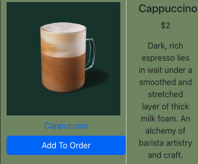

# Door_Drop_Backend

A PERN Stack food delivery platform that makes it easy to get great food from your favorite restaurants.

## _SEI 9-19 Project 4 PERN-Stack App_

#### Date: Dec 08, 2022

### By: Kevin Blanco

#### [LinkedIn](https://www.linkedin.com/in/kevinjblanco/) | [GitHub](https://github.com/greensharpie)

### [GitHub - Backend](https://github.com/greensharpie/Door_Drop_Backend) | [Trello Board](https://trello.com/b/xrNp2Go1/door-drop#) | [Heroku App](TBD)

---

### **_Description_**

Door Drop is a food delivery service, similar to competitors like Uber Eats, Postmates, GrubHub, and Doordash.

Authenticated Door Drop users can log in to:

- View a feed of restaurants for users looking to order great food and have it delivered to their home.
- Users will be able to search for specific restaurants by name.
- Restaurant owners will be able to add their restaurants and display food menu.

#### Component Hierarchy Diagram

---

### **_Technologies_**

####

- Front-End

  - React.js
  - Bootstrap

- Back-End

  - Sequelize
  - Express
  - PostgreSQL

---

### **_Screenshots_**

> #### **Landing Page**
>
> 

> #### **Restaurant Page**
>
> 

> #### **Restaurant Item Page**
>
> 

####

---

### **_Future Updates_**

####

- [] Add Items To Restaurant
- [ ] Continue Working On Mobile/Desktop Features
- [ ] Deployment

---

### **_Credits_**

####

#### Markdown Cheatsheet: [MarkdownGuide.org](https://www.markdownguide.org/cheat-sheet/)
